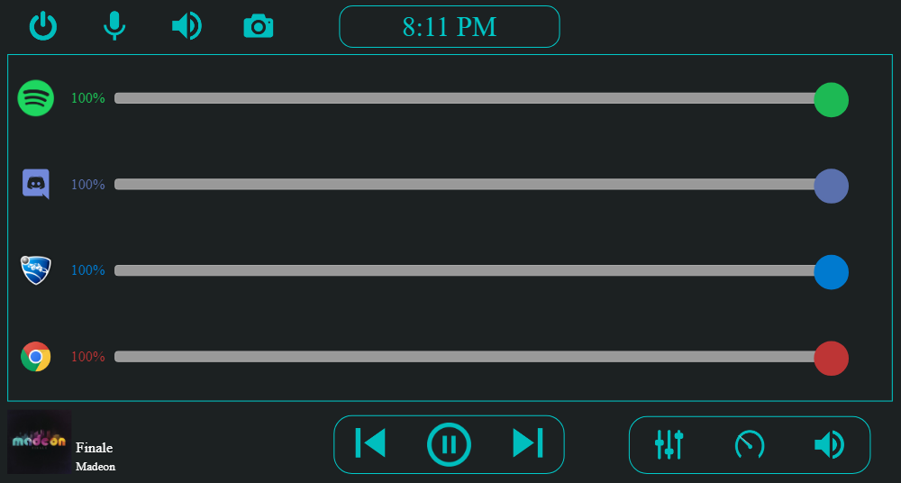

# Desktop-Control-Tablet
A Desktop Companion Tablet built to control my Windows 10 home computer with a Raspberry Pi and touch screen



## Features
- Live Spotify current track display and playback control
- Built in remote volume mixer control for any desktop program
- Change current audio output device
- Live desktop performance(CPU, memory) display
- Modular, which allows any practically any control-feature to be implemented and inserted
- Wireless Smart Bulb control and synchronization with f.lux

## Set up and usage
1) Install npm and nircmd on your PC
2) After cd'ing into the repo, run npm install to install all of the relevant packages
3) Set the IP of your main computer in the files
4) Connect to http://IP/ on the Pi
5)

## How to add a module
1) Create a view file(.pug), and optionally a .js, .css and settings(.json) file in their respective folders
```
public
   |  css
       | yourmodule.css
   | scripts
       | yourmodule.js
   | views
       | modules
       | yourmodule.pug
       | yourmodule.json
```
2) In your pug view file, the only requirement is to label the top-most/parent div the id in you will specifiy in ```view-settings.json```
```pug
   #yourmodule
      (content)
```

3) Add the module to ```view-settings.json```. The webpage will automatically include the script and style sheet files, as well as collect all of the json objects in ```yourmodule.json``` and send them alongside the rest of the settings data to the pug files, as well as when retrieving settings from sockets in the script files(such as in ```display.js```).
```
  "modules" = [..., "yourmodule"],
  "currentModules: [
    ...,
    {
      "name": "Your Module",
      "id": "yourmodule",
      "script": "yourmodule.js",
      "css": "yourmodule.css",
      "settings": "yourmodule.json"
    }
  ]
```
4) Add the module to the view ```middle-row.pug``` 
```pug
  each module in currentModules
    if(module.id == "volume-mixer")
      include ../modules/volume-mixer
    ...
    else if(module.id == "yourmodule")
      include ../modules/yourmodule
```

## Screenshots

## Libraries used
  #### Server side
  - Express
  - Socket.io
  - Spotify Web Api for receiving current tracks
  - os-utils for easy access to CPU & memory usage
  - querystring
  - body-parser
  - nircmd for access to more functions through the command line

  
  #### Client Side
  - jQuery
  - jQuery Transit for smooth transformations in jQuery for the performance dials
  - Handlebars for templating/modularity
  - Muuri for draggable components
  - Socket.io
